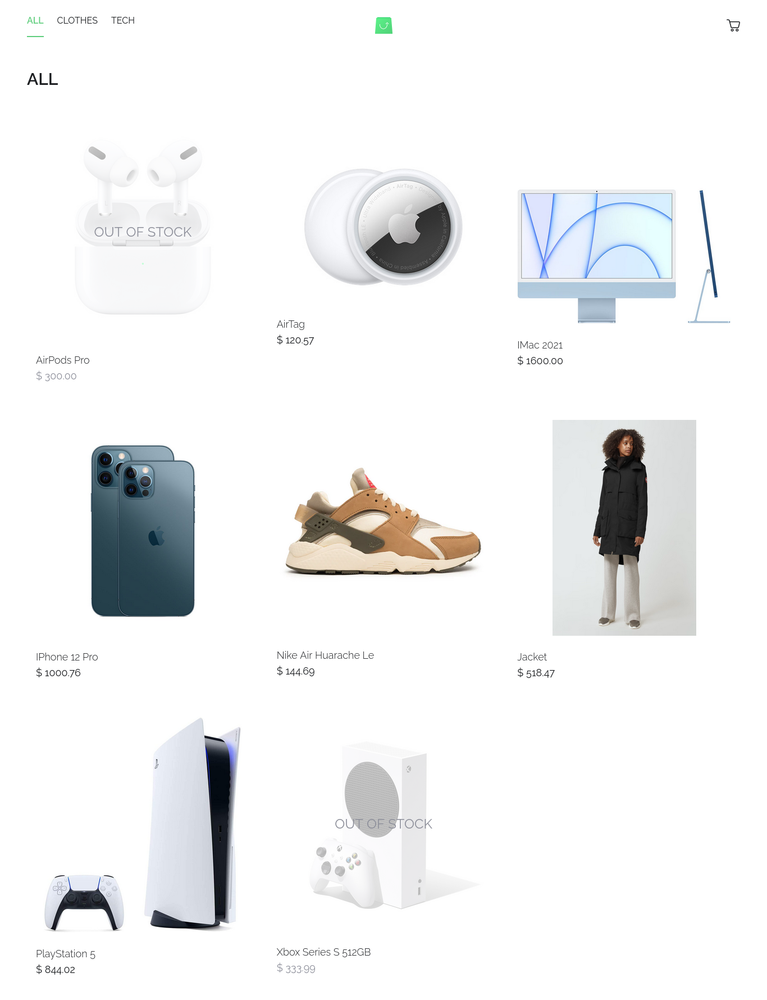

# Scandistore



A simple eCommerce website with product listing, and cart functionality built using the following technologies:

- **Backend**: PHP, MySQL, GraphQL
- **Frontend**: React.js, Apollo Client, TailwindCSS
- **Utilities**: phpdotenv, react-toastify, dompurify, html-react-parser

## Usage

To get started, follow these steps:

1. **Clone the Repository:**

   ```bash
   git clone https://github.com/devmuhammadzaki/scandistore.git
   ```

2. **Navigate to the Project Directory:**

   ```bash
   cd scandistore
   ```

3. **Install Dependencies:**

   ```bash
   composer install
   cd client && npm install
   ```

4. **Configure Environment:**

   - Rename the `.env.example` file in the root directory to `.env` and update the necessary variables.

   ```bash
    mv .env.example .env
   ```

5. **Database Setup:**

   - Create a database with the same name specified in `.env` (default is `scandistore_db`).
   - Run the SQL script found in `schema.sql` file in the root directory to create the required tables with appropriate schema and relations.

6. **Serve or Build the Frontend:**

   ```bash
   cd client/

   # For development:
   npm run dev

   # For production:
   npm run build
   ```

7. **Run the Start Script with No Timeout:**
   ```bash
   composer run-script start --timeout=0
   ```

## Project Structure

```
.
├── client
│   ├── index.html
│   ├── node_modules
│   ├── package.json
│   ├── package-lock.json
│   ├── postcss.config.js
│   ├── public
│   ├── README.md
│   ├── src
│   ├── tailwind.config.js
│   └── vite.config.js
├── composer.json
├── composer.lock
├── public
│   ├── assets
│   ├── favicon.ico
│   ├── index.html
│   └── index.php
├── README.md
├── schema.sql
├── src
│   ├── config
│   ├── Database.php
│   ├── GraphQL
│   ├── helpers.php
│   └── Models
└── vendor
```
